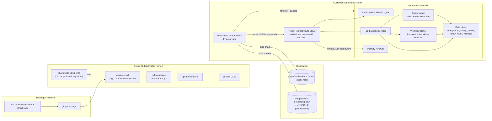

# Overall system: tools, environments, services, infrastructure

How everything fits together — from `git tag` to "customer's pod is serving traffic".

## Reading this diagram

- **Left third**: how new chart versions get built and published. Single source of truth = git tag.
- **Middle**: artifacts (chart .tgz in GCS, container images in GAR).
- **Right**: what runs at the customer. Three planes (data, workflow, query) plus the edge.
- **Trust boundary**: between the customer cluster and Peaka's CI is the GAR auth secret + the GCS bucket URL. Nothing else crosses.

## Annotations

- **Drone HMAC signature** is a tamper-evidence on the pipeline definition itself (not on artifacts).
- **`helm install` requires Traefik CRDs to be applied first** (separate `kubectl apply`). The chart cannot install them itself in a default install.
- **Each customer's `values.yaml` is private to them.** Peaka does not see customer values.
